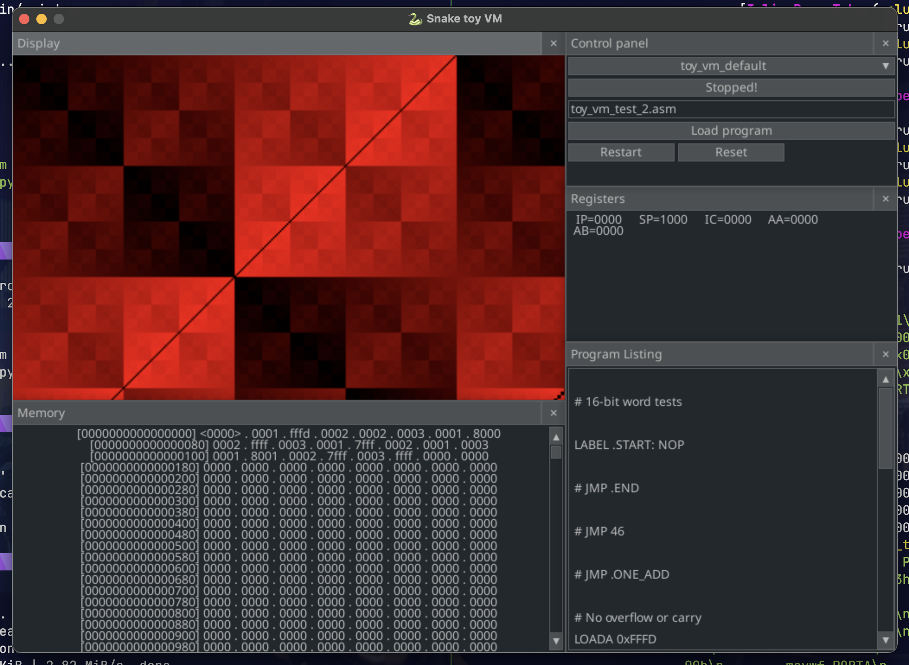

<p align="center">
  
</p>

# Snake toy VM

A generalized toy virtual machine, assembler and debuger written in python. Intended as just a fun time waster over a few weekends for myself, but maybe there is some educational value to others?
- Keeping things simple, illustrating basic ideas behind classical computing, emulation and vms. (Somehow we dragged in [@zayfod](https://github.com/zayfod) into this too, adding architectures)
- Modular
  - Allows for definition of custom assembly sytaxes
  - Swapping/ extending instruction sets
- VMs currently in project
  - Toy VM (In progress)
  - Brainfuck (Completed) ✔️
  - F4 MISc (Completed) ✔️
  - 8 bit PIC (In progress)
 
*It's all virtual machines in virtual machins in virtual machines ... and soon Transformer models infrencing the output of virtual machines ... - Probaly someone*
<p align="center">
  
</p>

## Install

### Pre
Clone repo
Install python 3.13 on system or virt. env.
Install `uv` (Optional):
```
pip install uv
```

Install deps:
```
uv pip install -r requirements.txt
```
or
```
pip install -r requirements.txt
```

## Run
Load with only default "Toy VM" virtual machine:
```
python main.py
```
Load with addition virtual machines define in python modules:
```
python main.py 8_bit_pic f4_misc brainfuck
```
or you can pass-in the same arch. module multiple times to get more than one instance of the same VM type
```
python main.py toy_vm toy_vm
```

## Contribute
Lint:
```
ruff check
```

Format:
```
ruff format
```


